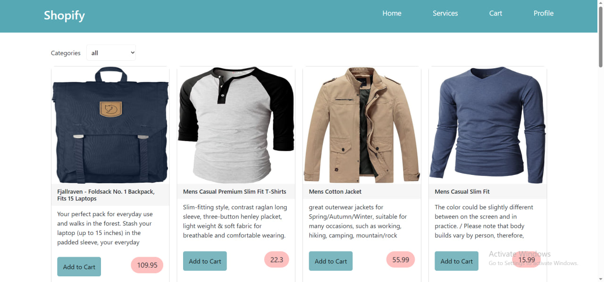
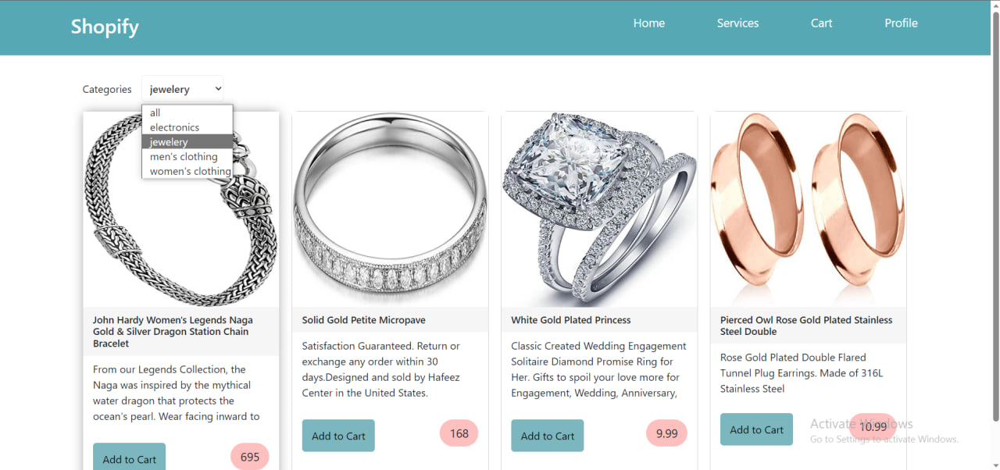
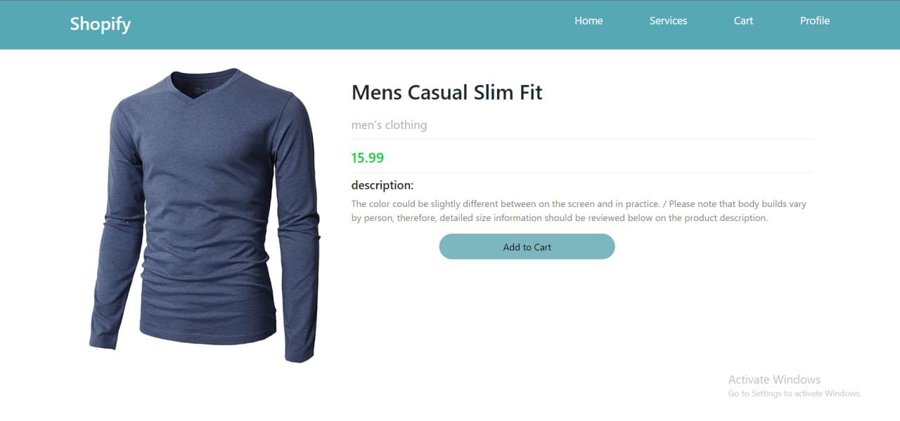
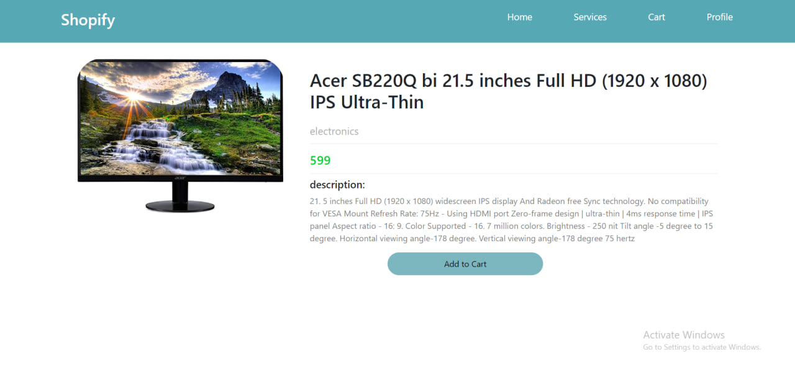

# shopify! online shopping website

## Overview

Shopify is an online shopping website developed using Angular and CSS. It offers users a seamless shopping experience, including features like product filtering by category and detailed product views. The project also integrates a fake API to provide product data, ensuring a realistic shopping experience.

## Key Features

- **Responsive Design:** The website boasts a responsive user interface, ensuring compatibility across various devices.

- **Product Filtering:** Users can easily filter products by category, streamlining the shopping process.

- **Product Details:** Detailed product information is just a click away, enhancing the user experience.

- **Loading Spinner:** A loading spinner is incorporated to provide visual feedback during data retrieval.

## Technologies Used

- Angular
- CSS

## Achievements

- Successfully designed and implemented a responsive front-end for a user-friendly online shopping platform.

- Enabled efficient product discovery through category-based filtering.

- Enhanced the user experience with comprehensive product detail views.

- Implemented visual feedback in the form of a loading spinner during data loading.

## Usage

To explore the project, follow these steps:

1. Clone the repository to your local machine.
2. Run `ng serve` to start the development server.
3. Open your browser and navigate to `http://localhost:4200/` to view the project.

## screenshots

  
  
  
  
  

